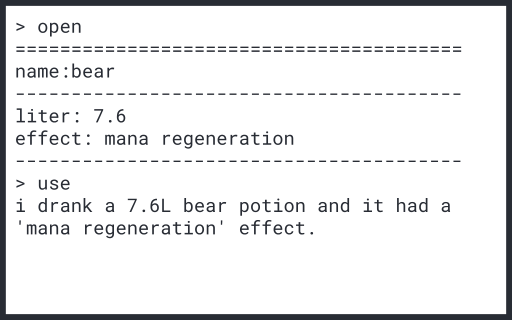

# ung-boxing
a tiny game for studying javascript concepts like class, succession, polymorphism, encapsulation.

## run with node.js

> npm run start  

## run with build
execute ung-boxing in release!

## commands
1. open  
get a box. a random item is in it. 

2. use  
use a item. after using item, item will be removed.

3. quit  
quit.

